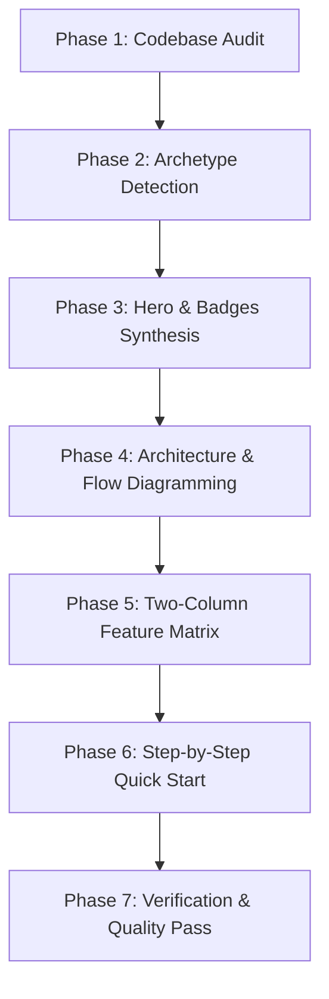
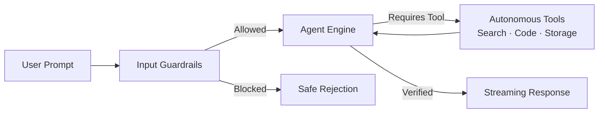
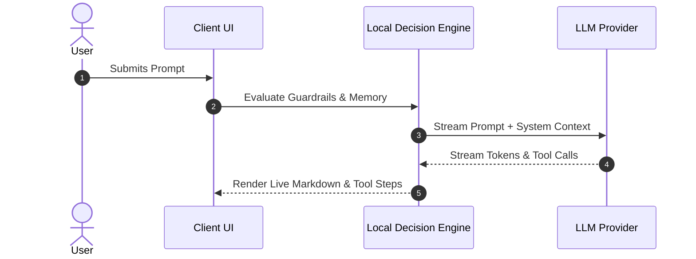

# Unified README Skill

This skill guides AI agents in crafting authentic, high-impact, and beautifully structured `README.md` files for any software project. It is modeled on high-converting open-source repositories and proven designs from production AI/web projects (such as Bravo, Pragati, and AI Parking System).

---

## The Core Philosophy: Evidence-First

> **The Golden Rule:** Every claim, metric, and command in a README must be grounded in actual repository evidence. A claim you cannot run or verify from the codebase is a claim you must not make.

When generating or upgrading a README, never invent benchmark numbers, hypothetical test suites, or uninstalled dependencies. Always inspect the codebase first.

---

## Workflow: Step-by-Step Procedure



### Phase 1: Codebase Audit (Fact Extraction)

Before writing a single line of Markdown, inspect the repository to collect concrete ground truth:

1. **Identity & Metadata:**
   - Inspect package manifests (`package.json`, `pyproject.toml`, `Cargo.toml`, `go.mod`, `pom.xml`).
   - Extract: Project name, accurate description, version, license, author/organization.
2. **Tech Stack & Dependencies:**
   - Note major frameworks (React, Vue, Vite, Next.js, FastAPI, Django, Express, Spring).
   - Note specialized libraries (LangChain, LangGraph, Tailwind CSS, Capacitor, PyTorch, Supabase, Firebase).
3. **Execution & Scripts:**
   - Read runnable scripts (`npm run dev`, `npm test`, `pytest`, `docker compose up`, `cargo build`).
   - Check required runtime prerequisites (Node.js version, Python version, Docker).
4. **Environment & Secrets:**
   - Look for `.env.example` or config files to identify required environment variables.
   - **Security Guardrail:** Never include real API keys, secrets, or production passwords in the README.
5. **Differentiators & Architecture:**
   - Examine entry points (`src/index.*`, `src/App.*`, `main.py`) to understand data flow, storage model (e.g. client-side `localStorage`, Supabase, SQLite), and external API integrations.

---

### Phase 2: Archetype & Audience Alignment

Identify which archetype best fits the project and adjust emphasis accordingly:

| Archetype | Key Characteristics | README Focus |
| :--- | :--- | :--- |
| **AI / Agent Applications** | LangGraph, Gemini, Groq, tool loops, memory, guardrails | Tool execution loop, privacy boundary, model selection, live telemetry |
| **Web Apps & SaaS** | Client-side apps, full-stack portals, dashboards | Live demo badge, user journeys, responsive feature tables, role permissions |
| **CLI & Developer Tools** | Utilities, linters, generators, test harnesses | 1-line installation, quickstart command, copy-paste terminal usage |
| **Libraries & SDKs** | Packages published to npm, PyPI, crates.io | API reference snippet, bundle size, TypeScript types, import examples |

---

### Phase 3: Hero & Branding Anatomy

Every flagship README starts with an unmistakable, centered hero section:

```markdown
<div align="center">

<!-- Optional Logo or Emblem -->


# Project Name

<p>
  <strong>A bold, 1-sentence value proposition highlighting what it does and why it matters.</strong><br />
  Key Differentiator 1 · Key Differentiator 2 · Key Differentiator 3
</p>

<!-- Curated Badge Row (Maximum 3 to 5 high-signal badges) -->
[](https://project.web.app)
[](LICENSE)
[](#)
[](#)

<!-- Centered Quick Navigation Bar -->
<p>
  <a href="#why-this-exists">Why This Exists</a> •
  <a href="#how-it-works">How It Works</a> •
  <a href="#features">Features</a> •
  <a href="#quick-start">Quick Start</a> •
  <a href="#roadmap">Roadmap</a>
</p>

</div>

---
```

---

### Phase 4: Tech Stack Grid

Curate official Shields.io badges using recognizable brand logos and coherent colors:

```markdown
### Tech Stack

<div align="center">


</div>
```

---

### Phase 5: "Why This Exists" & The Problem/Solution

Ground the project in real developer or user empathy. Explain what existing tools get wrong and why this architecture was chosen:

```markdown
## Why This Exists

Most existing solutions require complex server infrastructure, costly database subscriptions, and risk leaking sensitive API credentials. 

**Project Name** solves this by keeping the entire execution boundary inside your local environment:
- **Zero backend required** — operates completely client-side.
- **Direct API communication** — your credentials go straight from your device to the model provider.
- **Instant deployment** — serves as static assets from any CDN or hosting bucket.
```

Include a **Comparison Table** where relevant:

```markdown
| Dimension | Traditional Approach | Project Name |
| :--- | :--- | :--- |
| **Trust Boundary** | Server proxy stores history & keys | 100% local device storage |
| **Latency** | Network hop to backend server | Direct API streaming |
| **Hosting Cost** | $20+/mo servers & databases | $0 (Static hosting) |
| **Telemetry** | Full user tracking enabled | Zero telemetry, zero tracking |
```

---

### Phase 6: System Architecture & Mermaid Diagrams

Visual architecture makes complex logic instantly understandable. Use clean Mermaid flowcharts or sequence diagrams:

#### Flowchart Pattern (Agent / Tool Loop)
````markdown
## How It Works


````

#### Sequence Diagram Pattern (Request Lifecycle)
````markdown

````

---

### Phase 7: Responsive Two-Column Feature Matrix

Instead of flat, monotonous bullet lists, structure feature breakdowns using clean two-column HTML tables. This creates high density and visual polish:

```markdown
## Features

<table>
  <tr>
    <td width="50%" valign="top">
      <h3>🤖 Multi-Provider Models</h3>
      Switch between multiple state-of-the-art providers instantly:
      <ul>
        <li><strong>Google Gemini:</strong> Gemini 2.5 Flash, 2.5 Pro</li>
        <li><strong>Groq Cloud:</strong> Llama 3.3 70B with ultra-low latency</li>
        <li>Dynamic fallback when provider rate limits are hit</li>
      </ul>
    </td>
    <td width="50%" valign="top">
      <h3>🛡️ Deterministic Guardrails</h3>
      Client-side safety checks running with zero network latency:
      <ul>
        <li>Regex pattern blocking for private keys and tokens</li>
        <li>Custom blocklist and output token caps</li>
        <li>Transparent rejection feedback with zero silent failures</li>
      </ul>
    </td>
  </tr>
  <tr>
    <td width="50%" valign="top">
      <h3>🧠 Layered Memory</h3>
      State management built for long-term multi-session continuity:
      <ul>
        <li><strong>Session:</strong> Active conversation thread cache</li>
        <li><strong>Persistent:</strong> Cross-chat fact memory in <code>localStorage</code></li>
        <li>Autonomous memory saving and manual edit modal</li>
      </ul>
    </td>
    <td width="50%" valign="top">
      <h3>⚡ Zero Infrastructure</h3>
      No DevOps burden or recurring server expenses:
      <ul>
        <li>Runs purely static files on Firebase Hosting or Vercel</li>
        <li>Works offline for cached tools and historical records</li>
        <li>Instant spin-up in less than 5 seconds</li>
      </ul>
    </td>
  </tr>
</table>
```

---

### Phase 8: Quick Start & Local Setup

Provide crisp, non-interactive terminal commands that users can copy and run immediately:

````markdown
## Quick Start

### Prerequisites
- **Node.js** v18+ or v20+ ([Download](https://nodejs.org/))
- **Git** ([Download](https://git-scm.com/))

### Installation

1. **Clone the repository:**
   ```bash
   git clone https://github.com/username/project-name.git
   cd project-name
   ```

2. **Install dependencies:**
   ```bash
   npm install
   ```

3. **Configure environment variables:**
   ```bash
   cp .env.example .env.local
   ```
   Add your API keys in `.env.local`:
   ```env
   VITE_GEMINI_API_KEY=your_gemini_api_key_here
   ```

4. **Start the local development server:**
   ```bash
   npm run dev
   ```
   Open `http://localhost:5173` in your browser.
````

---

### Phase 9: Verification & Reproducible Proof

Enforce credibility by documenting exact commands used to run tests or verify the build:

````markdown
## Verification & Testing

Every metric and feature in this repository is tested and reproducible:

```bash
# Run the complete test suite
npm test

# Run end-to-end integration tests
npm run test:e2e

# Run linter and type-checker
npm run lint
npx tsc --noEmit
```
````

---

### Phase 10: Quality Verification Checklist

Before saving the generated README, verify:

- [ ] **No Fake Claims:** Every listed dependency and script actually exists in the project.
- [ ] **Working Badges:** All badge URLs follow valid Shields.io syntax and target existing routes.
- [ ] **Valid Mermaid:** Diagram syntax parses without syntax errors (quote special characters in labels).
- [ ] **Balanced HTML:** All `<table>`, `<tr>`, `<td>`, and `<div>` tags are properly matched and closed.
- [ ] **Mobile Scannable:** Tables wrap properly and code blocks specify exact language syntax highlighting.
- [ ] **Zero Secret Leakage:** No private tokens, credentials, or production connection strings are included.
