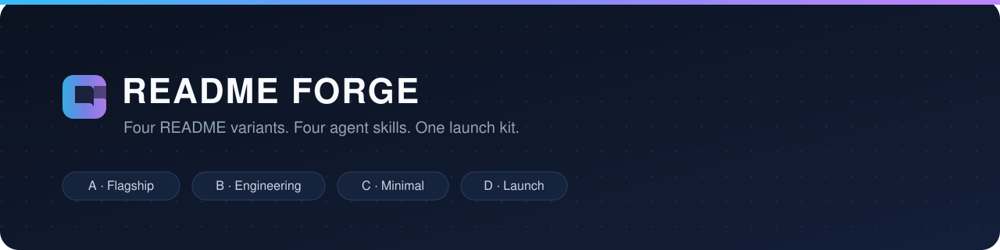
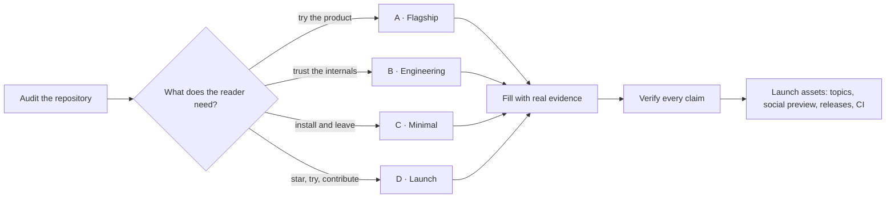

<p align="center">
  
</p>

<h1 align="center">README Forge</h1>

<p align="center">
  <strong>Ship open source that looks like it means it.</strong><br />
  Four README variants · four agent skills · a launch kit — everything a project needs to go from <em>code works</em> to <em>strangers can adopt it</em>.
</p>

<p align="center">
  <a href="LICENSE"></a>
  <a href="CONTRIBUTING.md"></a>
  
  
</p>

<p align="center">
  <a href="#install-it">Install</a> •
  <a href="#quick-start">Quick start</a> •
  <a href="#variants">Variants</a> •
  <a href="#skills">Skills</a> •
  <a href="#launch-kit">Launch kit</a> •
  <a href="#faq">FAQ</a>
</p>

---

## What this is

- **A README system, not a template.** Four variants — Flagship, Engineering, Minimal, Launch — chosen by what the reader must do next.
- **Agent skills that do the work.** `readme-forge`, `oss-launch`, `profile-readme`, and `badge-ci` are step-by-step procedures with output contracts and verification rules.
- **A launch kit.** Contributing guides, security policy, issue and PR templates, CI, dynamic badge recipes, a profile README, and a 40-item launch checklist.
- **Worked examples.** Three complete READMEs written for real repositories, so you can see each variant applied instead of imagining it.

Built for developers, students, and maintainers who want their repositories
to be taken seriously — by reviewers, recruiters, contributors, and strangers.

## The rule this kit enforces

> **No invented numbers.** Every metric in a README must sit next to the
> command that reproduces it. A claim you cannot run is a claim you should not
> make.

That single rule separates READMEs that get starred from READMEs that get
closed. The skills check for it; the validator nudges you toward it.

## How it works

In plain terms: pick the variant by what your reader must do next, fill it
with real evidence from your repository, verify every claim, then add the
launch extras before you publish.



## Install it

There is nothing to build — this repository is Markdown files, four agent
skills, and one small checker script. Three ways to adopt it:

### 1. Use a template in your own project

1. Pick a variant in [`templates/README.md`](templates/README.md) (A, B, C, or D).
2. Copy that variant's `README.md` over your project's `README.md`.
3. Replace every `{{TOKEN}}` using the [token table](templates/README.md#tokens).
4. Delete the guidance comments and push.

### 2. Copy the whole kit into an existing repository

| Copy | To get |
| :--- | :--- |
| `templates/` | The four README variants |
| `.agents/skills/` | The four agent skills (clients read each `SKILL.md`) |
| `.github/` | Issue forms, PR template, CI, funding |
| `docs/` | Research, checklists, and badge recipes |
| `examples/` | Filled drafts for real projects, to compare against |

Requirements: none beyond Git. Node.js 18+ is needed only to run the
optional checker (`node scripts/validate.mjs`).

### 3. Let your coding agent do it

Ask your agent: *"Use the `readme-forge` skill on this repository."* The skill
gathers evidence, fills the variant, verifies every claim, and reports what
it changed. The other three skills work the same way: `oss-launch`,
`profile-readme`, `badge-ci`.

## Quick start

```bash
git clone https://github.com/aadisthunder/readme-forge.git
cd readme-forge
node scripts/validate.mjs          # structural check
npx --yes markdownlint-cli2       # markdown hygiene (config-driven globs)
```

**Use a template:**

1. Open [`templates/README.md`](templates/README.md) and pick a variant.
2. Copy that variant's `README.md` over your project's README.
3. Replace every `{{TOKEN}}` using [the token table](templates/README.md#tokens).
4. Re-run the validator until it passes.

**Use a skill:** ask your coding agent to *"use the `readme-forge` skill on
this repository"* (or `oss-launch`, `profile-readme`, `badge-ci`). Each skill
is self-contained: evidence pass, procedure, verification, output contract.

## Variants

| Variant | For | Signature |
| :--- | :--- | :--- |
| [**A — Flagship**](templates/A-flagship/README.md) | Products with a UI or live demo | Banner, GIF, screenshot gallery, feature grid, comparison table |
| [**B — Engineering**](templates/B-engineering/README.md) | Engines, SDKs, anything judged on internals | Flow, sequence, and ER diagrams; module map; decisions and trade-offs; reproducible test table |
| [**C — Minimal**](templates/C-minimal/README.md) | Sharp libraries with great docs elsewhere | One image, three commands, links, done |
| [**D — Launch**](templates/D-launch/README.md) | Launch day and portfolio centerpieces | Story, animated proof, metrics with reproduce commands, community table, roadmap |

Full guide: [docs/variants.md](docs/variants.md) · Research behind them:
[docs/patterns.md](docs/patterns.md).

## Skills

| Skill | What it produces |
| :--- | :--- |
| [`readme-forge`](.agents/skills/readme-forge/SKILL.md) | A finished README in the chosen variant, plus a fill report mapping every claim to its source |
| [`oss-launch`](.agents/skills/oss-launch/SKILL.md) | A weighted readiness score (100 points), a prioritized fix plan, and the missing launch assets as real files |
| [`profile-readme`](.agents/skills/profile-readme/SKILL.md) | A build-in-public GitHub profile hub with curated badges, stats, and project cards |
| [`badge-ci`](.agents/skills/badge-ci/SKILL.md) | A working workflow plus honest, dynamic badges — and the pitfalls that make badges show "no status" |

## Worked examples

| Example | Variant | What it demonstrates |
| :--- | :--- | :--- |
| [examples/college-erp](examples/college-erp/README.md) | A · Flagship | Turning a feature list into a product page — with an honest security disclaimer |
| [examples/bravo](examples/bravo/README.md) | B · Engineering | Architecture diagrams, a module map, and decisions with trade-offs |
| [examples/pragati](examples/pragati/README.md) | D · Launch | Story, provable metrics, learner-model tables, community and roadmap |

## Launch kit

| Asset | Path |
| :--- | :--- |
| Contributing guide | [CONTRIBUTING.md](CONTRIBUTING.md) |
| Code of conduct | [CODE_OF_CONDUCT.md](CODE_OF_CONDUCT.md) |
| Security policy | [SECURITY.md](SECURITY.md) |
| Issue forms | [.github/ISSUE_TEMPLATE/](.github/ISSUE_TEMPLATE/config.yml) |
| Pull request template | [.github/PULL_REQUEST_TEMPLATE.md](.github/PULL_REQUEST_TEMPLATE.md) |
| CI for this repo | [.github/workflows/ci.yml](.github/workflows/ci.yml) |
| Reusable Node CI | [.github/workflows/reusable-node-ci.yml](.github/workflows/reusable-node-ci.yml) |
| Dynamic badge recipes | [docs/dynamic-badges.md](docs/dynamic-badges.md) |
| Launch checklist | [docs/launch-checklist.md](docs/launch-checklist.md) |
| Growth plan (topics, release, good first issues) | [docs/growth.md](docs/growth.md) |
| Profile README hub | [profile/README.md](profile/README.md) |
| Banner and social preview | [assets/](assets/banner.svg) |

## Repository layout

```text
readme-forge/
├── templates/             # four README variants + token reference
├── examples/              # three worked READMEs from real repositories
├── .agents/skills/        # four agent skills (SKILL.md per skill)
├── docs/                  # research, variant guide, checklists, badge recipes
├── profile/               # GitHub profile README hub
├── assets/                # banner and social preview (SVG)
├── scripts/validate.mjs   # tokens, links, fences, skill frontmatter
└── .github/               # CI, issue and PR templates, funding
```

## Roadmap

- [x] Four README variants with a token reference
- [x] Four agent skills with verification and output contracts
- [x] Launch kit, CI, and the profile hub
- [ ] Variant E: documentation-site README for large projects
- [ ] Automated demo-GIF pipeline (record, compress, embed)
- [ ] `npx readme-forge init` CLI that copies a variant and fills git metadata
- [ ] Translations (Hindi first)

## FAQ

<details>
<summary><strong>Do I need an AI agent to use this?</strong></summary>

No. The templates and docs are plain Markdown. The skills simply automate the
evidence pass, the fill, and the verification if your agent supports them.

</details>

<details>
<summary><strong>Can I use this for non-software projects?</strong></summary>

Yes — the variants are about reader intent, not code. Flagship works for
courses and datasets, Engineering for research methods, Launch for
communities. Delete sections a project cannot support rather than padding them.

</details>

<details>
<summary><strong>Will this make every repo look the same?</strong></summary>

Consistency in structure, not in voice. The kit fixes the skeleton — hero,
proof, quick start, license — so projects stop hiding their best material.
Voice and content stay yours; the examples show three deliberately different
tones.

</details>

<details>
<summary><strong>The validator flags my README. Now what?</strong></summary>

Each message names the file and the problem: an unresolved `{{TOKEN}}` outside
`templates/`, a broken relative link, unbalanced code fences, or a skill whose
frontmatter does not match its folder. Fix, re-run, done.

</details>

## Contributing

Contributions are welcome — read [CONTRIBUTING.md](CONTRIBUTING.md) and run
both local checks before opening a pull request.

## License

Released under the MIT license — see [LICENSE](LICENSE).

<p align="center">
  <sub>Inspired by the projects that do this best:
  <a href="https://github.com/matiassingers/awesome-readme">awesome-readme</a>,
  <a href="https://github.com/shadcn-ui/ui">shadcn/ui</a>,
  <a href="https://github.com/supabase/supabase">Supabase</a>,
  <a href="https://github.com/ohmyzsh/ohmyzsh">Oh My Zsh</a>, and
  <a href="https://github.com/thedotmack/claude-mem">claude-mem</a>.
  If this kit is useful to you, a ⭐ is the cheapest way to say thanks.</sub>
</p>
