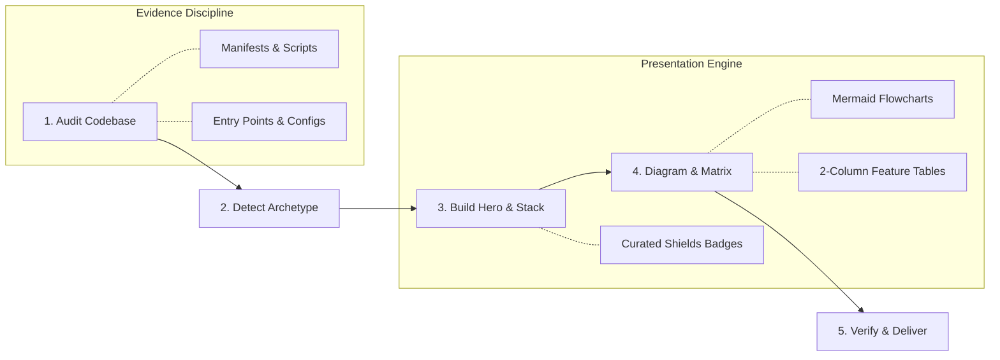
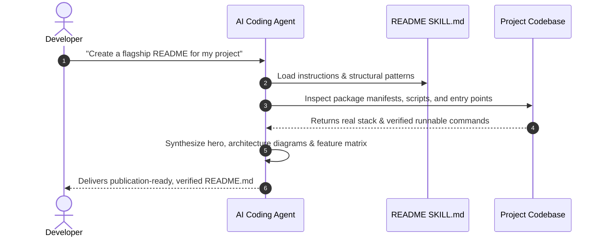
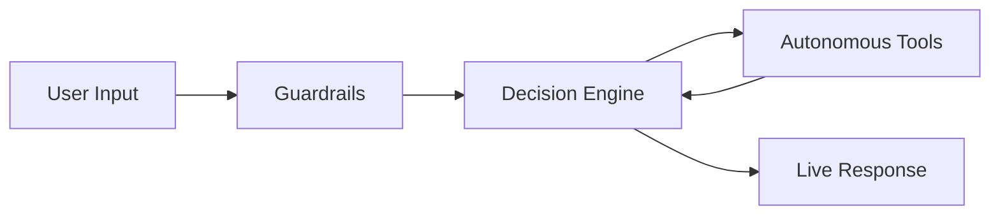

<div align="center">

# 🛠️ README Skill

<p>
  <strong>A unified, production-grade agent skill that teaches AI coding assistants how to craft high-converting, authentic, and beautifully designed project READMEs.</strong>
</p>

<p>
  <a href="LICENSE"></a>
  
  
  <a href="CONTRIBUTING.md"></a>
</p>

<p>
  <a href="#what-is-readme-skill">What It Is</a> •
  <a href="#why-this-exists">Why This Exists</a> •
  <a href="#how-it-works">How It Works</a> •
  <a href="#installation--setup">Installation &amp; Setup</a> •
  <a href="#how-to-use">How To Use</a> •
  <a href="#visual-showcase">Visual Showcase</a> •
  <a href="#contributing">Contributing</a>
</p>

</div>

---

## What is README Skill?

**README Skill** is a lightweight, portable skill package (`SKILL.md`) for AI coding agents such as **Claude Code**, **Codex**, **Antigravity**, **Cursor**, and **GitHub Copilot**.

When loaded into an agent's environment, it instructs the assistant to analyze your actual codebase and synthesize a **flagship open-source README** featuring:
- **Centered Hero Branding:** Crisp logos, bold 1-sentence value propositions, and curated Shields.io badges.
- **Tech Stack Badges:** Official tech logos and coherent color palettes.
- **Mermaid Architecture Diagrams:** Clean flowcharts and request-lifecycle sequence diagrams.
- **Responsive Two-Column Feature Matrices:** High-density, beautifully structured feature cards instead of flat bullet lists.
- **Evidence-First Verification:** Zero invented metrics or hallucinated scripts — every command is paired with real codebase evidence.

---

## Why This Exists

Most AI assistants generate bland, generic README files filled with placeholder text, non-existent CLI flags, and dry bullet lists that fail to communicate what makes a project special.

**README Skill** changes that by encoding the exact design language, layout standards, and evidence discipline found in top-tier open-source projects:

| Dimension | Default AI Generated README | README Skill Output |
| :--- | :--- | :--- |
| **Above the Fold** | Plain markdown title and wall of text | Centered hero branding, key badges, and anchor navigation |
| **Architecture** | Missing or vague text description | Visual Mermaid flowcharts and sequence diagrams |
| **Features** | Unformatted, repetitive bullet lists | Scannable, 2-column responsive HTML feature tables |
| **Accuracy** | Guessed commands and fake benchmark stats | Evidence-grounded commands verified from project manifests |
| **Visual Appeal** | Minimal / looks like raw notes | High-converting SaaS / flagship open-source aesthetic |

---

## How It Works

The skill guides the agent through an autonomous 5-stage synthesis pipeline:





---

## Installation & Setup

Install the skill in your project or global agent directory in seconds.

### Option 1: Claude Code

To add to Claude Code's global skill directory:

```bash
mkdir -p ~/.claude/skills/readme
curl -fsSL https://raw.githubusercontent.com/aadisthunder/readme-skill/main/.agents/skills/readme/SKILL.md -o ~/.claude/skills/readme/SKILL.md
```

Or add to your current project workspace:

```bash
mkdir -p .claude/skills/readme
curl -fsSL https://raw.githubusercontent.com/aadisthunder/readme-skill/main/.agents/skills/readme/SKILL.md -o .claude/skills/readme/SKILL.md
```

### Option 2: Codex

To install for Codex in your project workspace:

```bash
mkdir -p .codex/skills/readme
curl -fsSL https://raw.githubusercontent.com/aadisthunder/readme-skill/main/.agents/skills/readme/SKILL.md -o .codex/skills/readme/SKILL.md
```

### Option 3: Antigravity

To install for your current project workspace, copy the skill into your `.agents` folder:

```bash
mkdir -p .agents/skills/readme
curl -fsSL https://raw.githubusercontent.com/aadisthunder/readme-skill/main/.agents/skills/readme/SKILL.md -o .agents/skills/readme/SKILL.md
```

Or install globally across all your Antigravity workspaces:

```bash
mkdir -p ~/.gemini/config/skills/readme
curl -fsSL https://raw.githubusercontent.com/aadisthunder/readme-skill/main/.agents/skills/readme/SKILL.md -o ~/.gemini/config/skills/readme/SKILL.md
```

### Option 4: Cursor, GitHub Copilot & Other Agents

Clone or copy `.agents/skills/readme/SKILL.md` directly into your workspace rules or prompt catalog:

```bash
git clone https://github.com/aadisthunder/readme-skill.git
```

---

## How to Use

Once installed, simply prompt your agent naturally:

```text
"Inspect this repository and generate a flagship, production-grade README using the readme skill."
```

```text
"Upgrade our existing README.md: add a centered hero header, Mermaid architecture flowchart, and a two-column feature matrix."
```

The agent will automatically:
1. Discover and activate the `readme` skill.
2. Inspect your codebase files (`package.json`, `pyproject.toml`, Docker files, test scripts).
3. Generate a complete, polished `README.md` ready to commit.

---

## Visual Showcase

Here is a preview of the signature components the skill creates:

### 1. Centered Hero & Navigation
```markdown
<div align="center">
  
  <h1>Project Name</h1>
  <p><strong>A privacy-first AI assistant running entirely in your browser.</strong></p>
  <a href="#quick-start">Quick Start</a> • <a href="#features">Features</a> • <a href="#architecture">Architecture</a>
</div>
```

### 2. Responsive Two-Column Feature Matrix
```html
<table>
  <tr>
    <td width="50%" valign="top">
      <h3>🤖 Autonomous Tools</h3>
      <ul>
        <li>Real-time web search via Tavily</li>
        <li>Deterministic arithmetic calculator</li>
      </ul>
    </td>
    <td width="50%" valign="top">
      <h3>🛡️ Deterministic Guardrails</h3>
      <ul>
        <li>Regex pattern filtering for private keys</li>
        <li>Zero-latency client-side validation</li>
      </ul>
    </td>
  </tr>
</table>
```

### 3. Clean Mermaid Flowcharts


---

## Repository Structure

This repository is intentionally minimal and token-efficient. No heavy scripts, binary asset folders, or bloated dependencies:

```
readme-skill/
├── .agents/
│   └── skills/
│       └── readme/
│           └── SKILL.md       # The core agent skill definition
├── .gitignore                 # Clean environment & OS exclusions
├── CONTRIBUTING.md            # Guidelines for skill enhancements
├── LICENSE                    # MIT License
├── README.md                  # Project overview & documentation
└── SECURITY.md                # Responsible security disclosure
```

---

## Contributing

Contributions, feature suggestions, and new framework badge templates are welcome! Please check out [CONTRIBUTING.md](file:///CONTRIBUTING.md) to get started.

---

## License

Released under the [MIT License](file:///LICENSE). Created with pride by [@aadisthunder](https://github.com/aadisthunder).
