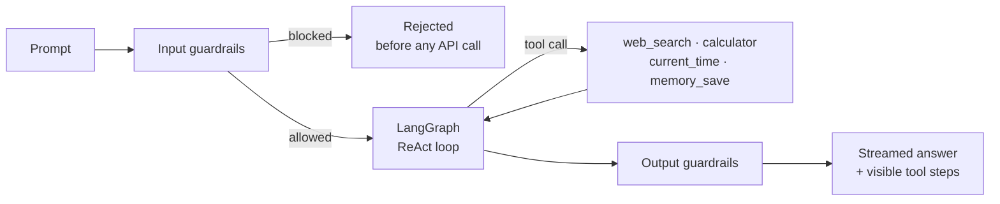
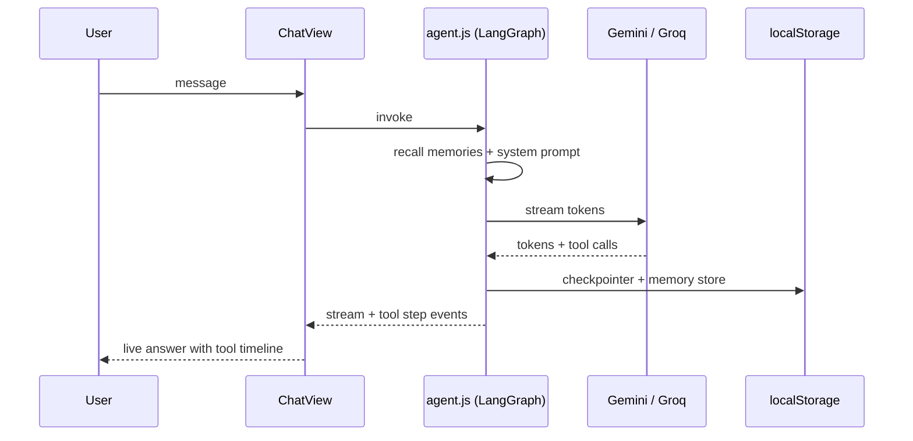

<!--
DRAFT — Variant B (Engineering) applied to Bravo.
Copy this file over the repository's README.md. Facts checked 2026-10-04.

FIXES INCLUDED (the current README has these problems):
  1. Clone instructions still say "Gyani-AI" (the repo's former name).
  2. The "Tests: 10 passing" badge is static — wire CI and make it dynamic.
  3. The Settings Reference is 8 tables long; here it is condensed with the
     full detail pointing at the app's Settings screen.
-->

<p align="center">
  
</p>

<h1 align="center">Bravo</h1>

<p align="center">
  <strong>A privacy-first AI assistant that runs entirely in your browser — autonomous tools, long-term memory, and guardrails on a LangGraph ReAct loop.</strong>
</p>

<p align="center">
  <a href="https://github.com/aadisthunder/Bravo/actions/workflows/ci.yml"></a>
  <a href="LICENSE"></a>
  <a href="https://bravo-ai-app.web.app"></a>
</p>

---

## Why this exists

Almost every AI chat app asks you to trust a server with your keys and your
conversation history. Bravo asks for neither: there is no backend, no proxy,
and no telemetry. Keys, chats, and memories live in your own
`localStorage` and go directly to the model provider.

**Design goal:** a real agent loop — tool use, memory, tracing — with the
entire trust boundary inside the browser tab.

---

## How it works



---

## Request lifecycle



---

## Module map

| Path | Responsibility |
| :--- | :--- |
| `app/src/App.jsx` | Root state, view router, settings persistence |
| `app/src/components/ChatView.jsx` | Chat UI, prompt bar, inline model selector |
| `app/src/components/SettingsView.jsx` | All eight settings sections |
| `app/src/components/OnboardingModal.jsx` | First-run walkthrough |
| `app/src/lib/agent.js` | LangGraph ReAct loop, streaming, tracer |
| `app/src/lib/tools.js` | Tavily search, calculator, time, memory save |
| `app/src/lib/guardrails.js` | Input/output safety rails |
| `app/src/lib/persistence.js` | `LocalStorageSaver` and `LocalStorageStore` |
| `app/src/lib/models.js` | Model factory and live API-key validation |
| `app/src/lib/settings.js` | Settings persistence and migration |

---

## Design decisions

| Decision | Why | Trade-off |
| :--- | :--- | :--- |
| No backend at all | Privacy by architecture; zero hosting cost; nothing to breach | Bundle carries the whole agent: ~2 MB uncompressed, 637 KB gzipped |
| LangGraph ReAct loop | Tool steps are inspectable and streamable in the UI | Heavier than a plain chat completion |
| Keys in `localStorage` | No account, no server-side key storage | Use dedicated keys with spend limits; anything in the browser is reachable by the browser |
| Deterministic guardrails | Zero-latency checks that do not need a model call | Regex and blocklists catch patterns, not semantics |
| Browser-local memory | Conversations survive reloads without an account | Per-browser only; no sync across devices |

---

## Testing

| Suite | Command | Covers |
| :--- | :--- | :--- |
| `onboarding_and_models.test.js` | `npm test` | Onboarding state, model factory |
| `settings_theme.test.js` | `npm test` | Settings persistence, theme resolution |

The current suite is 10 tests across 2 suites. The CI badge above is the
source of truth — this section deliberately contains no frozen count.

```bash
cd app
npm install
npm test
npm run build
```

### Build notes

The production bundle is intentionally large for a client-side app because
LangChain and Zod are bundled. Measure it yourself before quoting a number:

```bash
npm run build && ls -lh dist/assets
```

---

## Quick start

```bash
git clone https://github.com/aadisthunder/Bravo.git
cd Bravo/app
npm install && npm run dev
```

Open `http://localhost:5173` — the onboarding walkthrough covers everything
else. Bring at least one free API key: Gemini, Groq, Tavily, or LangSmith.

<details>
<summary><strong>Providers and what each key unlocks</strong></summary>

| Provider | Get a key | Needed for |
| :--- | :--- | :--- |
| Google Gemini | [aistudio.google.com/apikey](https://aistudio.google.com/apikey) | Gemini models |
| Groq Cloud | [console.groq.com/keys](https://console.groq.com/keys) | Llama / GPT-OSS models |
| Tavily | [app.tavily.com](https://app.tavily.com/home) | The `web_search` tool |
| LangSmith | [smith.langchain.com](https://smith.langchain.com/settings) | Optional run tracing |

</details>

<details>
<summary><strong>Configuration highlights</strong></summary>

| Setting | Range / values | Default |
| :--- | :--- | :--- |
| Provider | Google Gemini, Groq Cloud | Gemini |
| Temperature | 0 – 1.5 | 0.7 |
| Max tokens | 256 – 8192 | 2048 |
| History depth | 4 – 50 messages | 20 |
| Guardrails | on / off, custom words and `/regex/` | on |
| Max output characters | 1000 – 50000 | 20000 |
| Theme | light / dark / system | system |

Every setting is stored locally; the app's Settings screen is the full
reference.

</details>

---

## Extending it

1. Add a tool in `app/src/lib/tools.js` — one definition with a Zod schema.
2. Register it in the agent's tool list in `app/src/lib/agent.js`.
3. Add a toggle row in `SettingsView.jsx`.
4. Cover it in `app/tests/` with the existing Vitest setup.

---

## Project layout

```text
Bravo/
├── firebase.json            # SPA rewrites + cache headers
└── app/
    ├── index.html
    ├── src/
    │   ├── components/      # ChatView, Sidebar, Settings, Onboarding, Message
    │   └── lib/             # agent, tools, guardrails, persistence, models
    └── tests/               # Vitest suites
```

---

## Contributing

Issues and pull requests are welcome — see [CONTRIBUTING.md](CONTRIBUTING.md).

## License

Released under the MIT license — see [LICENSE](LICENSE).
