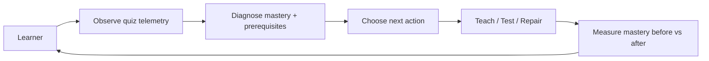
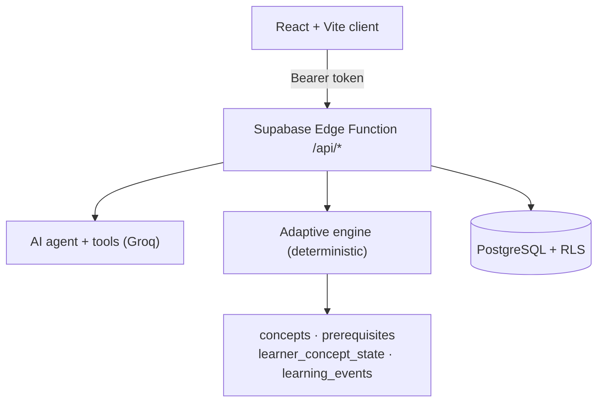

<!--
DRAFT — Variant D (Launch) applied to pragati.
Copy this file over the repository's README.md. Facts checked 2026-10-04.

WHAT CHANGED vs the current README:
  - Story section moved above the fold; the 90-second tour promoted.
  - Proof table now pairs every metric with its reproduce command.
  - Architecture uses Mermaid; learner model explained in one table.
  - Community/support table, roadmap, and star-history slot added.
  - Deep deploy guide moved into a collapsed section (still complete).
-->

<p align="center">
  
</p>

<h1 align="center">Pragati (प्रगति) — the AI tutor that learns how you learn</h1>

<p align="center">
  <a href="#quick-start">Quick start</a> •
  <a href="#proof">Proof</a> •
  <a href="#how-it-works">How it works</a> •
  <a href="#roadmap">Roadmap</a> •
  <a href="#community">Community</a>
</p>

<p align="center">
  <a href="https://pragati-aadi.web.app"></a>
  <a href="LICENSE"></a>
  <a href="https://github.com/aadisthunder/pragati/actions/workflows/ci.yml"></a>
</p>

---

## The problem

Ask an AI to explain derivatives and you get a good explanation. Ask it whether
you *learned* anything, and it has no idea — and it never finds out.

## The idea

Pragati builds a learner model from your answers, response time, hints, and
skipped questions. It diagnoses the concept — and the prerequisite concept —
actually blocking you, chooses the next best action, teaches, retests, and
measures whether the intervention worked.

## Why I built this

I kept watching students pass quizzes by pattern-matching and fail the topic a
week later. A tutor that cannot tell the difference is guessing. Pragati is my
attempt to make the tutor's judgment testable: a deterministic engine decides
pedagogy, an LLM writes content, and the whole loop is evaluated by a
30-scenario harness anyone can run.

---

## Demo

<!-- TODO: record the 90-second flow as a GIF (quiz -> mastery deltas ->
     prerequisite repair -> micro-lesson) and place it here next to the
     star-history chart. Static screenshots are below in the visual tour. -->

<table align="center">
<tr>
<td align="center">
  
  <br /><sub>Socratic tutor: questions before answers, LaTeX and photo input</sub>
</td>
<td align="center">
  <a href="https://star-history.com/#aadisthunder/pragati&Date">
    
  </a>
  <br /><sub>Delete this cell until the chart is non-trivial.</sub>
</td>
</tr>
</table>

**The 90-second tour:** open the live demo → click *Try the Adaptive Demo* →
take the diagnostic quiz (wrong answers are useful evidence) → watch mastery
bars move on the results screen → see the engine diagnose a weak prerequisite
→ follow *Do it now with AI* into the targeted lesson → check the Concept
Mastery Map in Analytics.

---

## Proof

Every number below is produced by the repository's own harness — run the
command and match it. No number on this page is invented.

| Metric | Value | Reproduce with |
| :--- | :--- | :--- |
| Adaptation accuracy | **30/30 scenarios (100%)** | `npm --prefix server test` |
| Backend tests | **238 passing** | `cd server && npm test` |
| Frontend tests | **105 passing** | `cd client && npm test` |
| Anti-cheating | Answers stripped server-side | inspect `/api/quiz` response in DevTools |

The harness covers hidden-prerequisite failures, hint-reliant "high scorers",
slow-but-correct fluency gaps, and difficulty transitions.

---

## How it works



**Architecture:** the frontend never talks to the database or the AI directly.
A Supabase Edge Function routes everything; the adaptive engine is a pure
TypeScript module shared by the function and the test suite.



| Learner-model table | What it stores |
| :--- | :--- |
| `concepts` / `concept_prerequisites` | The concept graph the engine walks upward |
| `question_concepts` | Tags questions to concepts |
| `learner_concept_state` | Mastery, confidence, attempts, response time, next review |
| `learning_events` | Every mastery transition, so interventions can be evaluated |

**Security model:** row-level security scoped to `auth.uid()` on every table;
the service role is used only to upsert shared taxonomy data, never learner
data.

---

## Quick start

```bash
npm run install:all
npm run dev:server      # terminal 1
npm run dev:client      # terminal 2
```

Open `http://localhost:5173`. You need a free Supabase project and a free Groq
API key; the full setup (environment files, schema SQL, judge seed) is in the
collapsed section below.

<details>
<summary><strong>Full setup, schema, and deployment (4 parts)</strong></summary>

### Environment

```env
# server/.env
SUPABASE_URL=https://<project>.supabase.co
SUPABASE_ANON_KEY=<anon key>
GROQ_API_KEY=gsk_<key>

# client/.env
VITE_SUPABASE_URL=https://<project>.supabase.co
VITE_SUPABASE_ANON_KEY=<anon key>
VITE_API_URL=
```

### Database

Run `supabase/schema.sql` in the Supabase SQL editor, then
`supabase/seed/judge-demo.sql` to seed the judge demo.

### Deploy

- Frontend: Firebase Hosting (`npm run build:client` → `firebase deploy --only hosting`).
- Backend: Supabase Edge Function (`supabase functions deploy api`).
- Set the Supabase **Site URL** to your live domain before enabling Google
  sign-in — otherwise redirects silently fall back to `localhost`.

### Alternative backend

`server/` is a standard Express app and deploys unchanged to Render or
Railway; point `VITE_API_URL` at it and rebuild.

</details>

---

## Roadmap

- [x] Deterministic adaptive engine with a 30-scenario evaluation harness
- [x] Socratic tutor with OCR, LaTeX, and goal-driven memory
- [ ] Public evaluation report page generated from the harness (`docs/EVALUATION.md`)
- [ ] Classroom mode: teacher dashboards over anonymized class mastery
- [ ] Hindi interface and content
- [ ] Spaced-review notifications and calendar export

---

## Community

| Channel | Best for |
| :--- | :--- |
| [GitHub Issues](https://github.com/aadisthunder/pragati/issues) | Bugs and concrete feature requests |
| [Good first issues](https://github.com/aadisthunder/pragati/labels/good%20first%20issue) | Your first contribution |

<!-- TODO: enable GitHub Discussions and add it to the table as the channel
     for open-ended questions, then point new contributors there. -->

### Contributors

<a href="https://github.com/aadisthunder/pragati/graphs/contributors">
  
</a>

---

## FAQ

<details>
<summary><strong>Why is the decision engine not an LLM?</strong></summary>

Because the same evidence must always produce the same decision. A rule engine
is testable, evaluable, and cannot hallucinate a lesson plan. The LLM generates
content; it never decides pedagogy.

</details>

<details>
<summary><strong>How is the demo safe to try?</strong></summary>

The writable adaptive-demo account contains only disposable seed data; the
read-only judge account is locked by database policies. Both are isolated from
any real learner data.

</details>

<details>
<summary><strong>How do I evaluate this quickly?</strong></summary>

There is a read-only "Instant Judge Login" on the live site with pre-loaded
history and analytics, and every metric above reproduces from the test suite.

</details>

---

## Contributing

Contributions are welcome — read [CONTRIBUTING.md](CONTRIBUTING.md) first, or
start from a good first issue.

## License

Released under the MIT license — see [LICENSE](LICENSE).

<p align="center">
  <sub>If Pragati is useful to you, a ⭐ helps other students find it.</sub>
</p>
