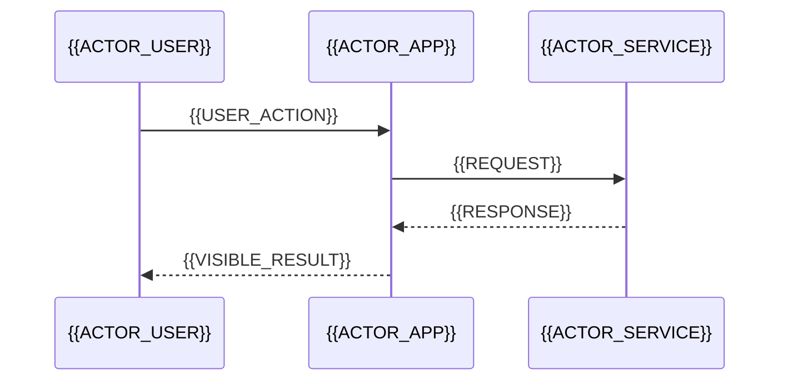

<!--
TEMPLATE — Variant B: Engineering

WHAT IT IS
  A proof-first README for readers who decide with architecture diagrams and
  test output: engineers, reviewers, maintainers, recruiters with taste.

USE IT WHEN
  - The project has real internals worth explaining: an engine, a pipeline, an SDK, a protocol.
  - You want to show engineering judgment (trade-offs), not just visuals.
  - The project is judged by code quality (hackathons, job applications, infrastructure).

AVOID IT WHEN
  - The audience is non-technical or the project's value is purely visual (use Variant A).

HOW TO USE
  1. Copy over README.md. 2. Replace tokens. 3. Delete guidance comments.
  4. Keep diagrams small and true: one flow, one lifecycle, one data model.
  5. Every number in the Testing table must be reproducible with the command next to it.
-->

<p align="center">
  
</p>

<h1 align="center">{{PROJECT_NAME}}</h1>

<p align="center">
  <strong>{{TAGLINE}}</strong>
</p>

<p align="center">
  <a href="{{CI_URL}}"></a>
  <a href="{{COVERAGE_URL}}"></a>
  <a href="LICENSE"></a>
</p>

---

## Why this exists

<!-- Two paragraphs: the job to be done, then the design goal that shaped the code.
     "The interesting part is not that it works — it is *how* it works." -->

{{MOTIVATION}}

**Design goal:** {{DESIGN_GOAL}}

---

## How it works

```mermaid
flowchart LR
  A[{{INPUT}}] --> B[{{STAGE_1}}]
  B --> C[{{STAGE_2}}]
  C --> D[{{STAGE_3}}]
  D --> E[{{OUTPUT}}]
  C -.->|"{{FAILURE_PATH}}"| F[{{RECOVERY}}]
```

<!-- Keep to ~8 nodes. If it does not fit on a phone screen, split it into two diagrams. -->

---

## Request lifecycle



---

## Data model

```mermaid
erDiagram
  {{ENTITY_1}} ||--o{ {{ENTITY_2}} : {{RELATIONSHIP}}
  {{ENTITY_2}} ||--o{ {{ENTITY_3}} : {{RELATIONSHIP}}
```

<!-- Delete this whole section if the project has no persistent state. -->

---

## Module map

<!-- The table that saves new contributors an hour. One row per meaningful path. -->

| Path | Responsibility |
| :--- | :--- |
| `{{PATH_1}}` | {{RESPONSIBILITY_1}} |
| `{{PATH_2}}` | {{RESPONSIBILITY_2}} |
| `{{PATH_3}}` | {{RESPONSIBILITY_3}} |
| `{{PATH_4}}` | {{RESPONSIBILITY_4}} |
| `{{PATH_5}}` | {{RESPONSIBILITY_5}} |

---

## Design decisions

<!-- The section that shows judgment. Each row: what you chose, why, what it costs. -->

| Decision | Why | Trade-off |
| :--- | :--- | :--- |
| {{DECISION_1}} | {{WHY_1}} | {{TRADEOFF_1}} |
| {{DECISION_2}} | {{WHY_2}} | {{TRADEOFF_2}} |
| {{DECISION_3}} | {{WHY_3}} | {{TRADEOFF_3}} |

---

## Testing

<!-- Rule: no number without a command. A skeptic must be able to run this and match it. -->

| Suite | Command | What it covers |
| :--- | :--- | :--- |
| {{SUITE_1}} | `{{TEST_COMMAND_1}}` | {{COVERAGE_1}} |
| {{SUITE_2}} | `{{TEST_COMMAND_2}}` | {{COVERAGE_2}} |

Measured locally on {{ENVIRONMENT}}: **{{MEASURED_RESULT}}** — reproduce with:

```bash
{{REPRODUCE_COMMAND}}
```

---

## Extending it

<!-- Plugin points, extension APIs, or "how to add your own X" in four steps. -->

1. {{EXTEND_STEP_1}}
2. {{EXTEND_STEP_2}}
3. {{EXTEND_STEP_3}}

---

## Project layout

```text
{{REPO}}/
├── {{TOP_LEVEL_1}}   # {{TOP_LEVEL_1_NOTE}}
├── {{TOP_LEVEL_2}}   # {{TOP_LEVEL_2_NOTE}}
├── {{TOP_LEVEL_3}}   # {{TOP_LEVEL_3_NOTE}}
└── README.md
```

---

## Development setup

```bash
{{DEV_COMMAND_1}}
{{DEV_COMMAND_2}}
{{DEV_COMMAND_3}}
```

Requirements: {{REQUIREMENTS}}

---

## Contributing

Issues and pull requests are welcome — see [CONTRIBUTING.md](CONTRIBUTING.md).

## License

Released under the {{LICENSE}} license — see [LICENSE](LICENSE).
